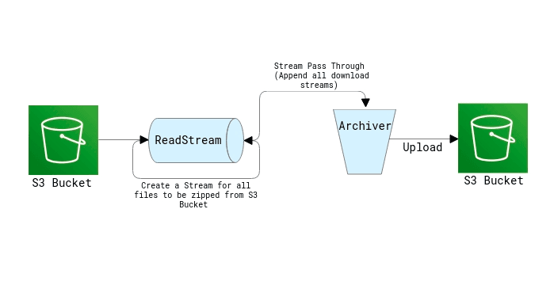

# AWS Lambda: zip aws s3 directory by stream

## Description
>
> This is a lambda function that will zip a s3 prefix and upload it to another s3 path. It will use stream to zip files, so it will not use too much memory. It will be very useful when you want to zip a large directory in s3.



## Local Test

```bash
npm install
sh ./local_run.sh
```

> You can test the function in local by `sh ./local_run.sh`. before you run this script, you need to modify `data.json` in current directory.

* If you want to zip a s3 prefix, you need to modify `data.json` like this:

    ```json
    {
    "bucket": "your-bucket",
    "inputDir": "your-prefix",
    "outputKey": "sample.zip"
    }
    ```

* if you want to zip some files, than files in different directory, you need to modify `data.json` like this:

    ```json
    {
    "bucket": "your-bucket",
    "outputKey": "sample.zip",
    "files": [
        {
        "key": "your-prefix/your-file1",
        "fileName": "file1.png" 
        },
        {
        "key": "your-prefix/your-file2",
        "fileName": "file2.txt"
        }
    ]
    }
    ```

    **if fileName is not set, the default value is the last part of key.**

* if you input file and output file in different bucket, you need to modify `data.json` like this:

    ```json
    {
    "inputBucket": "input-bucket",
    "outputBucket": "output-bucket",
    "outputKey": "sample.zip",
    "files": [
        {
        "key": "your-prefix/your-file1",
        "fileName": "file1.png" 
        },
        {
        "key": "your-prefix/your-file2",
        "fileName": "file2.txt"
        }
    ]
    }
    ```

## Deploy

```bash
npm install
./node_modules/.bin/sls deploy
```

## Reference

* [Create Zip Using AWS Lambda with Files Streamed from S3](https://www.antstack.com/blog/create-zip-using-lambda-with-files-streamed-from-s3/)
* [Zip files on S3 with AWS Lambda and Node](https://dev.to/lineup-ninja/zip-files-on-s3-with-aws-lambda-and-node-1nm1)
